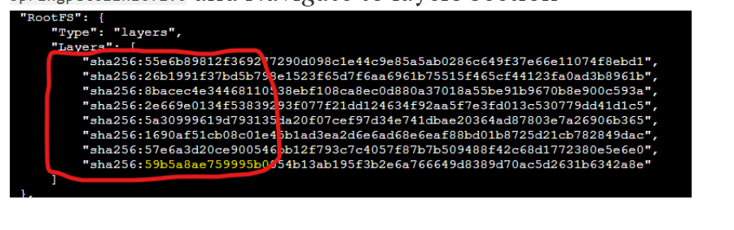

Docker Image Creation and Docker Image Layers
---------------------------------------------

### Dockerfile Introduction
* In this section we would cover Dockerfiles and instructions.
* Dockerfile is a simple plain text file that contains set of user defined instructions which will be call during building the image.
* [Refer Here](https://docs.docker.com/reference/dockerfile/) for Dockerfile reference

#### Syntax
* Generic Syntax is `INSTRUCTION arguments` for eg `FROM alpine` or `RUN echo 'Hello'`
* Dockerfile should start with a **FROM** instruction which specifies the base image.

#### Docker File Instructions
* **FROM:**
   * Syntax is `FROM <image>[:tag] [As <name>].`
   * **note:** any thing in [] above are optional
   * This instruction sets the base image.
   * Multiple FROM statements are also allowed to support multistage builds
   * [Refer Here](https://docs.docker.com/reference/dockerfile/#from) for more info
* **LABEL :**
   * Adds metadata to the image
   * [Refer Here](https://docs.docker.com/reference/dockerfile/#label) for more info.
* **RUN :**
   * This command takes arguments in two forms
      * Shell form: `RUN <command>`      
         * In this command runs in a shell
      * exec form: RUN ["executable", "param1", "param2" ]   
         * In this way comand execution doesn’t require a defaault shell
  * Each RUN instruction will execute the commands in the new layer on top of current image
  * [Refer Here](https://docs.docker.com/reference/dockerfile/#run) for more info.
* **COPY:**
   * copies file from soure to destination.
   * Syntax: `COPY <src> <dest>`  
   * src in above syntax is only files and directories . URL’s are not supported
   * [Refer Here](https://docs.docker.com/reference/dockerfile/#copy) for more info
* **ADD:**
   * copies file from soure to destination.
   * Syntax: `ADD <src> <dest>`   
   * src in above syntax is only files and directories . URL’s are supported as source.
   * [Refer Here](https://docs.docker.com/reference/dockerfile/#add) for more info
* **ENTRYPOINT:**
   * Command which gets executed when the docker container is created from image.
   * **CMD** acts as argument to the **ENTRYPOINT**   
   * [Refer Here](https://docs.docker.com/reference/dockerfile/#entrypoint) for more info
* **CMD:**
   * [Refer Here](https://docs.docker.com/reference/dockerfile/#cmd) for more info
   * TO understand CMD and ENTRYPOINT interatction [Refer Here](https://docs.docker.com/reference/dockerfile/#understand-how-cmd-and-entrypoint-interact)
* **EXPOSE:**
    * [Refer Here](https://docs.docker.com/reference/dockerfile/#expose)

#### Building an Image
* Lets build a spring-pet-clinic app image
* Manually to execute spring pet clinic
   * Clone from Github using the following [HTTPS url](https://github.com/spring-projects/spring-petclinic). `git clone https://github.com/spring-projects/spring-petclinic.git`
   * Ensure Java and maven are installed.
   * Execute the following command to build the image `mvn package`
   * Copy spring-petclinic*.jar file from target folder to any folder in your linux machine.
   * Execute the following command to run the container “` java -jar spring-petclinic*.jar“
* From the above understanding lets write the Dockerfile
   * Create a new directory called as spring-petclinic 
   * Create a file called as Dockerfile
   * Copy the spring-petclinic.jar to samefolder
   * Insert the following contents
```
FROM openjdk:8
LABEL author="KHAJA"
LABEL version="1.0"
COPY ./spring-petclinic.jar /spring-petclinic.jar
EXPOSE 8080
ENTRYPOINT ["java", "-jar"] 
CMD ["/spring-petclinic.jar"]
```
   * Execute the docker image build command `docker image build -t springpetclinic:1.0 .`
   * Try to create container with following command
   `docker container run -d -p 8080:8080 springpetclinic:1.0`

* Lets examine the layers
   * Execute the following command `docker image inspect openjdk:8`
   * Navigate to Layers and have a look at highlighted layers
   * Total we have seven layers
   * Now execute the following command `docker image inspect springpetclinic:1.0` and Navigate to layers section
   
* The result of the observations above are
   * We had one extra copy instruction which had led to creation of new layer for the image springpetclinic:1.0 (which is highlighted in yellow at the bottom)
   * Every instruction (RUN, ADD, COPY etc ) leads to the creation of new image layers
* All of these layers are combined in the image & as well as container.
* These layers are readonly layers
      

